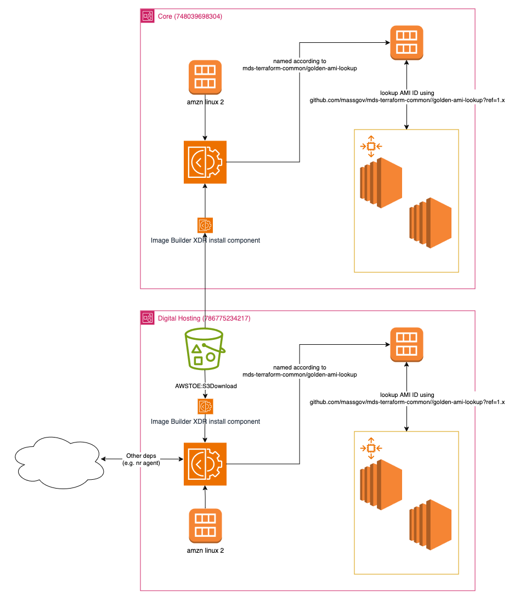

# Golden AMI Image Builder

This module implements infrastructure which builds, tests, and releases an EOTSS-compliant Golden AMI based on Amazon Linux 2 AMD64. Using AWS Image Builder as the primary tool to do so, the module creates a simple image recipe, an associated Image Builder pipeline, and a simple distribution configuration. Images are private, and are distributed to the account in which they are built according to the image naming convention specified in the [golden-ami-lookup](../golden-ami-lookup/README.md) module.

## High-Level Module Design



The module creates the following resources:

- A simple Image Builder recipe based on Amazon Linux 2 with a few extra components and tests:
  - Cortex XDR agent (implemented as a [custom Image Builder component](https://docs.aws.amazon.com/imagebuilder/latest/userguide/create-component-console.html))
  - Cloudwatch agent
  - AWS CLI v2
  - Package patches
  - Instance boot test
  - ENI attachment test
  - `yum` repository test
- An Image Builder infrastructure configuration, which determines how the pipeline will create and network build instance(s)
- An Image Builder distribution configuration, which describes how output AMIs will be named, permissioned, etc.
- A private S3 bucket to capture pipeline logs
- Various IAM roles and policies to facilitate the above

## Usage

```hcl
resource "aws_kms_key" "bucket_key" {
  description = "Encryption/decryption key for ${aws_s3_bucket.distribution_bucket.id}"
  policy      = jsondecode({
    # ...
  })
}

resource "aws_s3_bucket" "distribution_bucket" {
  bucket = "my-cool-distribution-bucket"
}

resource "aws_s3_bucket_server_side_encryption_configuration" "distribution_bucket" {
  bucket = aws_s3_bucket.distribution_bucket.id

  rule {
    bucket_key_enabled = true
    apply_server_side_encryption_by_default {
      kms_master_key_id = aws_kms_key.bucket_key.key_id
      sse_algorithm     = "aws:kms"
    }
  }
}

module "golden_ami_build" {
  source = "github.com/massgov/mds-terraform-common//golden-ami-builder?ref=1.x"

  # Identifier of bucket where binaries/libraries/etc required by the pipeline are stored
  software_distribution_bucket_id = aws_s3_bucket.distribution_bucket.id

  # SSE key used by software distribution bucket
  software_distribution_bucket_key_arn = aws_kms_key.bucket_key.arn

  # Name of VPC where build instance should be launched
  vpc_name = "My-Cool-VPC-NonProd"

  # Custom tags will be applied in addition to any default tags specified at the provider level
  tags = {
    "jeepers" = "creepers"
  }
}
```
