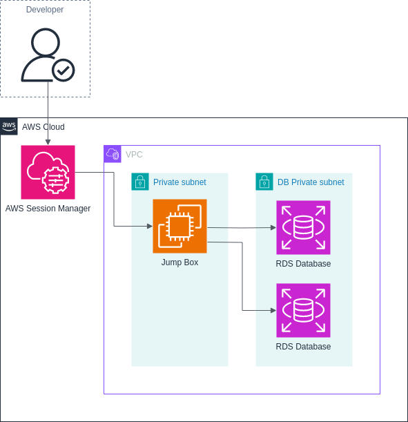

<!-- Most of this file is auto-generated. Only edit the parts before the "BEGIN_TF_DOCS" or after "END_TF_DOCS". -->

# SOE Jump Box Module

This module creates a jump box that allows using Session Manager to connect to private instances. Using SSM means the jump box does not need to be connected to the public internet.



### Example

```terraform
# Look up latest al2023 ami
data "aws_ami" "default_ami" {
  most_recent = true
  owners      = ["amazon"]
  filter {
    name   = "architecture"
    values = ["arm64"]
  }
  filter {
    name   = "name"
    values = ["al2023-ami-2023*"]
  }
}

module "vpc" {
  source = "git@github.com:massgov-eotss/soe-v2-modules//vpc?ref=v0.3.0"
  # ...
}

module "jump" {
  source = "git@github.com:massgov-eotss/soe-v2-modules//jump-box?ref=v0.3.0"
  vpc_id = modules.vpc.vpc_id
  subnet_id = modules.vpc.private_subnet_ids[0]
  ami = data.aws_ami.jump.id
  name = "EXAMPLE-JUMP"
}

resource "aws_security_group" "db" {
  name   = "EXAMPLE"
  vpc_id = var.vpc

  # ... other ingress/egress rules

  # Allow ingress from jump box security group on port 5432
  ingress {
    from_port       = 5432
    protocol        = "tcp"
    to_port         = 5432
    security_groups = [module.jump.jump_box_security_group]
  }
}

resource "aws_db_instance" "default" {
  name = "EXAMPLE_DB_NAME"
  vpc_security_group_ids = [aws_security_group.db.id]
  # ...
}

```

### Start session

```bash
#!/usr/bin/env bash

JUMP_INSTANCE=$(aws ec2 describe-instances --filters Name=tag:Name,Values="EXAMPLE-JUMP" Name=instance-state-name,Values=running --query "Reservations[0].Instances[0].InstanceId" --output text)

aws ssm start-session \
    --target $JUMP_INSTANCE

```

### Port forwarding to remote db

```bash
#!/usr/bin/env bash

JUMP_INSTANCE=$(aws ec2 describe-instances --filters Name=tag:Name,Values="EXAMPLE-JUMP" Name=instance-state-name,Values=running --query "Reservations[0].Instances[0].InstanceId" --output text)
DB_HOST=$(aws rds describe-db-instances --db-instance-identifier "EXAMPLE_DBNAME" --query "DBInstances[0].Endpoint.Address" --output text)

aws ssm start-session \
    --target $JUMP_INSTANCE
    --document-name AWS-StartPortForwardingSessionToRemoteHost \
    --parameters "{\"host\":[\"$DB_HOST\"],\"portNumber\":[\"5432\"], \"localPortNumber\":[\"5432\"]}"

```

<!-- BEGIN_TF_DOCS -->
## Requirements

| Name | Version |
|------|---------|
| <a name="requirement_terraform"></a> [terraform](#requirement\_terraform) | >= 1.8 |
| <a name="requirement_aws"></a> [aws](#requirement\_aws) | >= 5.45 |

## Providers

| Name | Version |
|------|---------|
| <a name="provider_aws"></a> [aws](#provider\_aws) | >= 5.45 |

## Modules

No modules.

## Resources

| Name | Type |
|------|------|
| [aws_iam_instance_profile.profile](https://registry.terraform.io/providers/hashicorp/aws/latest/docs/resources/iam_instance_profile) | resource |
| [aws_iam_role.jump](https://registry.terraform.io/providers/hashicorp/aws/latest/docs/resources/iam_role) | resource |
| [aws_iam_role_policy_attachment.ssm](https://registry.terraform.io/providers/hashicorp/aws/latest/docs/resources/iam_role_policy_attachment) | resource |
| [aws_iam_role_policy_attachment.ssm_managed](https://registry.terraform.io/providers/hashicorp/aws/latest/docs/resources/iam_role_policy_attachment) | resource |
| [aws_instance.this](https://registry.terraform.io/providers/hashicorp/aws/latest/docs/resources/instance) | resource |
| [aws_security_group.this](https://registry.terraform.io/providers/hashicorp/aws/latest/docs/resources/security_group) | resource |
| [aws_iam_policy_document.assume_by_ec2](https://registry.terraform.io/providers/hashicorp/aws/latest/docs/data-sources/iam_policy_document) | data source |

## Inputs

| Name | Description | Type | Default | Required |
|------|-------------|------|---------|:--------:|
| <a name="input_ami"></a> [ami](#input\_ami) | The ami to use for the jump box. If the SSM Agent is not already installed on the ami, it should be installed through the user\_data variable. | `string` | n/a | yes |
| <a name="input_instance_type"></a> [instance\_type](#input\_instance\_type) | The instance type to use for the instance. | `string` | `"t4g.nano"` | no |
| <a name="input_name"></a> [name](#input\_name) | Name to use for the instance. | `string` | n/a | yes |
| <a name="input_subnet_id"></a> [subnet\_id](#input\_subnet\_id) | The VPC subnet to launch the instance in. | `string` | n/a | yes |
| <a name="input_user_data"></a> [user\_data](#input\_user\_data) | User data to use when creating the instance. | `string` | `null` | no |
| <a name="input_volume_size"></a> [volume\_size](#input\_volume\_size) | Size of the root volume in gibibytes. | `number` | `null` | no |
| <a name="input_volume_type"></a> [volume\_type](#input\_volume\_type) | Volume type for the root volume. | `string` | `null` | no |
| <a name="input_vpc_id"></a> [vpc\_id](#input\_vpc\_id) | The VPC to launch the instance in. | `string` | n/a | yes |

## Outputs

| Name | Description |
|------|-------------|
| <a name="output_jump_box_instance"></a> [jump\_box\_instance](#output\_jump\_box\_instance) | n/a |
| <a name="output_jump_box_security_group"></a> [jump\_box\_security\_group](#output\_jump\_box\_security\_group) | n/a |
<!-- END_TF_DOCS -->

## Development

To regenerate the documentation, install [`terraform-docs`](https://terraform-docs.io/) and run `terraform-docs .`

## Credits and Resources

This module is based on the [VPC Secure Access POC by MightyAcornDigital](https://github.com/MightyAcornDigital/vpc-secure-access-poc).
